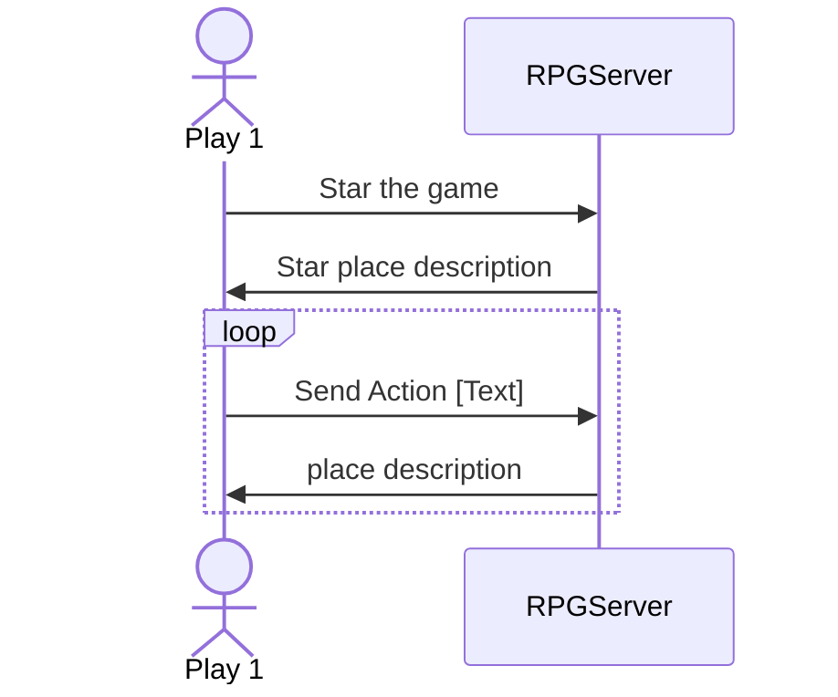

# TextualRPG

Textual RPG is a project to build a multi player RPG on a textual base

## Star principal

The first goal of the application is to send place location description on player action.




## How to participate

install commitizen

```shell
npm install -g commitizen
```

use commitizen

```shell
cz
```
